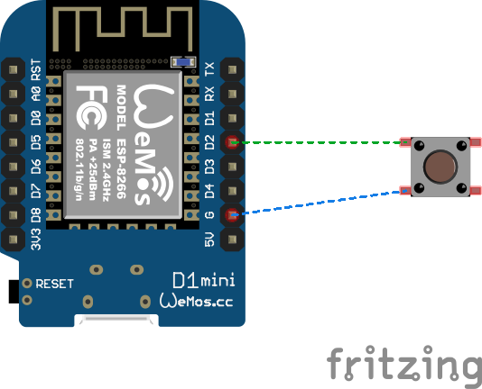
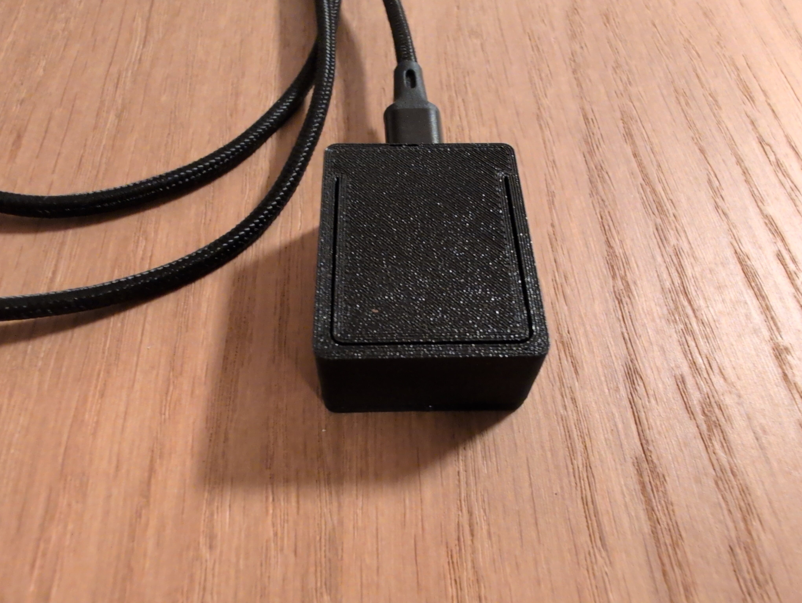

# ESP8266 Home Assistant Button

A small, 3D-printed wired button based on an ESP8266 for use with [Home Assistant](https://www.home-assistant.io/).

The button connects to Wi-Fi and can be used to trigger automations in Home Assistant. The enclosure is 3D printed, with the electronics mounted inside.

# Features
 - ESP8266-based
 - Wi-Fi connected
 - Integrates with Home Assistant
 - Custom 3D-printed enclosure
 - Simple physical push button
 - Configured using ESPHome

# Hardware
 - Wemos D1 Mini Board
 - Push Button

# Wiring

# 3D-Printed Parts

The enclosure is available on [Thingiverse](https://www.thingiverse.com/thing:7417104)

# ESPHome Configuration

The button is configured using ESPHome.

Change the api key and wifi credentials accordingly.

# Home Assistant

Once the ESP8266 is flashed with ESPHome and correctly configured, it shows up in Home Assistant under the ESPHome integration. The button can then be used as a trigger for automations, I use it to toggle the smart plug for my desk.

# Photo

